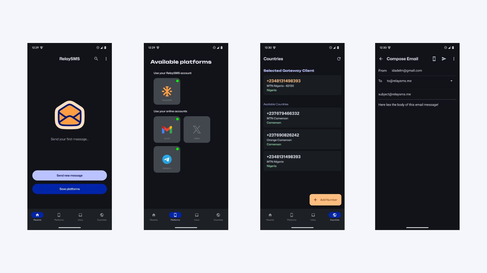

# RelaySMS - Android
--------



Connecting the world, one SMS at a time.

[](https://apt.izzysoft.de/fdroid/index/apk/com.afkanerd.sw0b)
[](https://play.google.com/store/apps/details?id=com.afkanerd.sw0b)


## Contents

*   [About](#about)
*   [Encryption and Security](#encryption-and-security)
*   [Token Storage and Vault](#token-storage-and-vault)
*   [Getting Started](#getting-started)
    *   [Prerequisites](#prerequisites)
    *   [Installation](#installation)
*   [Build Instructions](#build-instructions)
    *   [Building from Source](#building-from-source)
*   [Contribution Guidelines](#contribution-guidelines)
*   [Publishing Payload](#publishing-payload)
*   [Platform Specific Publications](#platform-specific-publications)
*   [Resources and Further Reading](#resources-and-further-reading)
*   [Contact](#contact)

## <a name="about"></a> About

RelaySMS (also known as swob, short for SMSWithoutBorders) is a tool that lets you send secure online messages via SMS without needing an internet connection. RelaySMS allows you to stay connected even when offline by securely storing OAuth2 tokens for services like Gmail, Twitter, and Telegram in encrypted online Vaults.

**Gateway Clients**

RelaySMS utilizes gateway clients (identified by their MSISDN) to route SMS messages. You can manage these gateway clients within the app, allowing you to add new clients or switch between existing ones. To learn more about gateway clients and how they work, refer to the following resources:

*   [Contributing: Gateway Client](https://docs.smswithoutborders.com/docs/contributing/gateway-client)
*   [Gateway Clients Guide](https://docs.smswithoutborders.com/docs/Gateway%20Clients%20Guide/GatewayClientsGuide)
*   [API V3: Get Gateway Clients](https://github.com/smswithoutborders/SMSWithoutBorders-Gateway-Server/blob/main/docs/api_v3.md#get-gateway-clients)

## <a name="encryption-and-security"></a> Encryption and Security

RelaySMS employs robust encryption methods to protect your data and ensure secure communication. For a detailed explanation of the cryptographic methods used in the vault, please refer to the [security documentation](https://github.com/smswithoutborders/SMSwithoutborders-BE/blob/main/docs/security.md#cryptographic-methods-used-in-the-vault).

*   **AES (Advanced Encryption Standard):**  Encrypts and decrypts data at rest in the vault.

*   **Fernet Encryption:** Fernet encryption with a 32-byte key is used for encrypting and decrypting identity tokens used by the vault.

*   **HMAC (Hash-based Message Authentication Code):** Generates and verifies HMACs for unique values in the vault.

*   **Double Ratchet Algorithm:** The [Double Ratchet algorithm](https://github.com/smswithoutborders/lib_signal_double_ratchet_java) is used to provide End-to-Vault encryption with perfect forward secrecy for secure messaging.

These cryptographic methods work together to provide a layered security approach, safeguarding your data and communications within the RelaySMS ecosystem.

## <a name="token-storage-and-vault"></a> Token Storage and Vault

RelaySMS utilizes a secure vault to store OAuth2 tokens for various services. These tokens allow you to access your accounts and send messages through these services without repeatedly entering your credentials.

**Here's how the vault works:**

1.  **Token Encryption:** When you grant RelaySMS access to a platform (e.g., Gmail), the app receives an OAuth2 token. This token is immediately encrypted using AES-256 with a unique key.

2.  **Vault Storage:** The encrypted token is then stored in the RelaySMS vault. The vault itself is protected by various security measures, including access controls and encryption. You can learn more about the vault specifications in the [documentation](https://github.com/smswithoutborders/SMSwithoutborders-BE/blob/main/docs/specifications.md).

3.  **Token Retrieval:** When you need to send a message through a service/platform, RelaySMS retrieves the encrypted token from the vault. It then decrypts the token and uses it to authenticate with the platform (e.g Gmail).

This secure token storage and retrieval process ensures that your sensitive credentials are never stored in plain text and are protected from unauthorized access.

## <a name="getting-started"></a> Getting Started

### <a name="prerequisites"></a> Prerequisites

*   Android Studio (latest stable version recommended)
*   Android SDK
*   Git
*   Basic understanding of Android development and Kotlin

### <a name="installation"></a> Installation

You can install RelaySMS directly from the following sources:

*   **F-Droid:** [Link to F-Droid](https://apt.izzysoft.de/fdroid/index/apk/com.afkanerd.sw0b)
*   **Google Play Store:** [Link to Google Play Store](https://play.google.com/store/apps/details?id=com.afkanerd.sw0b)

## <a name="build-instructions"></a> Build Instructions

### <a name="building-from-source"></a> Building from Source

1.  Clone the repository:
    ```bash
    git clone https://github.com/smswithoutborders/SMSWithoutBorders-App-Android.git
    ```
2. Open the project in Android Studio.
3. Create a `release.properties` file in the project's root directory (refer to `release.properties.example` for a template).
4. Build and run the app on your device or emulator.

## <a name="contribution-guidelines"></a> Contribution Guidelines
We welcome contributions from the community! Here's how you can get involved:
1.  Clone the repository.
2.  Create a new branch from the `dev` branch for your feature or bug fix.
3.  Make your changes and commit them with descriptive messages.
4.  Push your changes and submit a pull request to the `dev` branch

Please ensure your code follows our coding style guidelines and includes appropriate tests.

## <a name="publishing-payload"></a> Publishing Payload

RelaySMS uses a specific payload structure for publishing messages. Refer to the code snippet below for details on packing and unpacking the payload:
```python
import struct
import base64

platform_letter = b'g'
encrypted_content=b'...'
device_id=b'...'

payload = struct.pack("<i", len(encrypted_content)) + pl + encrypted_content + device_id
incoming_payload = base64.b64encode(payload)

# unpacking in Python
payload = base64.b64decode(incoming_payload)
len_enc_content = struct.unpack("<i", payload[:4])[0]
platform_letter = chr(payload[4])
encrypted_content = payload[5 : 5 + len_enc_content]
device_id = payload[5 + len_enc_content :]

# getting header from published messages
encrypted_payload = base64.b64decode(encrypted_content)
len_header = struct.unpack("<i", encrypted_payload[0:4])[0]
header = encrypted_payload[4: 4 + len_header]
content_ciphertext = encrypted_payload[4 + len_header:]
```

## <a name="platform-specific-publications"></a> Platform Specific Publications (Encrypted Content)

RelaySMS supports publishing encrypted content to various platforms with specific formatting:
```python3
""" Email (Gmail etc)
"""
# to:cc:bcc:subject:body

""" Messages (Telegram etc)
"""
# to:body

""" Text (X; Twitter etc)
"""
# body
```

## <a name="resources-and-further-reading"></a> Resources and Further Reading

*   **Official Documentation:** [https://docs.smswithoutborders.com/](https://docs.smswithoutborders.com/)
*   **Blog:** [https://blog.smswithoutborders.com/](https://blog.smswithoutborders.com/)
*   **GitHub Repository (Backend):** [https://github.com/smswithoutborders/SMSwithoutborders-BE](https://github.com/smswithoutborders/SMSwithoutborders-BE)

## Special thanks to:
- [@mikropsoft](https://github.com/mikropsoft) for adding Turkish localization.

## <a name="contact"></a> Contact

*   **Website:** [https://relay.smswithoutborders.com/](https://relay.smswithoutborders.com/)
*   **Email:** [developers@smswithoutborders.com](mailto:developers@smswithoutborders.com)
*   **X(Formerly Twitter):** [@RelaySMS](https://x.com/relaysms)

We appreciate your interest in RelaySMS. Don't forget star this repo :)

